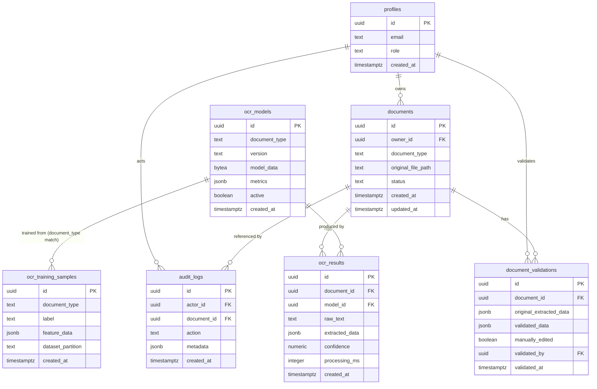

# Modelo de datos

**Fase:** 0 — Planificación y arquitectura
**Estado:** propuesta de diseño. Las migraciones SQL reales se crean en Fase 1 en
`supabase/migrations/`, versionadas y referenciadas aquí una vez existan.

## 1. Diagrama entidad-relación (lógico)



## 2. Entidades

### `profiles`
Espejo 1:1 de `auth.users` (Supabase Auth), con el rol de aplicación.

| Columna | Tipo | Notas |
|---|---|---|
| `id` | `uuid` PK | igual a `auth.users.id` |
| `email` | `text` | copiado de auth, no fuente de verdad de credenciales |
| `role` | `text` | `USER` \| `ADMIN`, `CHECK` constraint |
| `created_at` | `timestamptz` | default `now()` |

Se crea automáticamente vía trigger en `auth.users` (definido en Fase 1).

### `documents`
| Columna | Tipo | Notas |
|---|---|---|
| `id` | `uuid` PK | default `gen_random_uuid()` |
| `owner_id` | `uuid` FK → `profiles.id` | not null, indexado |
| `document_type` | `text` | `invoice_es` por ahora; ver `docs/ocr/pipeline.md` §perfiles |
| `original_file_path` | `text` | ruta en Storage: `{user_id}/{document_id}/original.{ext}` |
| `status` | `text` | `uploaded` \| `processing` \| `processed` \| `validated` \| `failed` |
| `created_at` / `updated_at` | `timestamptz` | |

Índices: `(owner_id, created_at desc)` para listados paginados; `(status)`;
`(document_type)`. Índices adicionales sobre campos de `ocr_results.extracted_data`
(proveedor/fecha/monto) se evalúan en Fase 2 según necesidad real de RF-005.

### `ocr_results`
Un documento puede tener múltiples ejecuciones OCR (reintentos, re-entrenamiento del
modelo). `extracted_data` es JSONB para tolerar distintos perfiles documentales sin
migración de esquema:

```json
{
  "proveedor": { "value": "...", "confidence": 0.0, "sourceRegion": {"x":0,"y":0,"w":0,"h":0} },
  "nit": { "value": "...", "confidence": 0.0, "sourceRegion": {} },
  "fecha": { "value": "...", "confidence": 0.0, "sourceRegion": {} },
  "iva": { "value": 0.0, "confidence": 0.0, "sourceRegion": {} },
  "valor": { "value": 0.0, "confidence": 0.0, "sourceRegion": {} },
  "total": { "value": 0.0, "confidence": 0.0, "sourceRegion": {} }
}
```

Campos actualizados en Fase 4e con datos reales de Mansor (facturación colombiana) —
reemplaza el conjunto original de Fase 0 (`proveedor`, `fecha`, `monto_total` +
`numero_factura` deseado). `monto_total` pasó a llamarse `total`; `numero_factura` se
retiró del alcance obligatorio (no se pidió en la actualización); se agregaron `nit` e
`iva`. Ver `docs/requirements/traceability.md` (RF-003) y `CLAUDE.md` §8.

| Columna | Tipo | Notas |
|---|---|---|
| `id` | `uuid` PK | |
| `document_id` | `uuid` FK → `documents.id` | not null, indexado |
| `model_id` | `uuid` FK → `ocr_models.id` | nullable hasta que exista un modelo activo |
| `raw_text` | `text` | texto reconstruido completo, para auditoría/depuración |
| `extracted_data` | `jsonb` | estructura por campo, ver arriba |
| `confidence` | `numeric(4,3)` | 0.000–1.000, ver fórmula en `docs/ocr/algorithms.md` |
| `processing_ms` | `integer` | medido real, para RNF-001 |
| `created_at` | `timestamptz` | |

### `document_validations`
Conserva el resultado OCR original y el validado por el humano (RF-007), nunca
sobrescribe `ocr_results`.

| Columna | Tipo | Notas |
|---|---|---|
| `id` | `uuid` PK | |
| `document_id` | `uuid` FK → `documents.id` | |
| `original_extracted_data` | `jsonb` | copia de `ocr_results.extracted_data` en el momento de validar |
| `validated_data` | `jsonb` | datos finales confirmados por el usuario |
| `manually_edited` | `boolean` | true si difiere de `original_extracted_data` |
| `validated_by` | `uuid` FK → `profiles.id` | |
| `validated_at` | `timestamptz` | |

### `ocr_models`
| Columna | Tipo | Notas |
|---|---|---|
| `id` | `uuid` PK | |
| `document_type` | `text` | `invoice_es`, etc. |
| `version` | `text` | ej. `invoice_es_v1` |
| `model_data` | `bytea` \| `jsonb` (a decidir en Fase 4c según formato real del modelo kNN — vecinos + metadatos) | |
| `metrics` | `jsonb` | métricas de evaluación reales, ver `docs/ocr/evaluation.md` |
| `active` | `boolean` | solo un modelo activo por `document_type` (constraint a nivel de aplicación + índice único parcial) |
| `created_at` | `timestamptz` | |

### `ocr_training_samples`
Muestras etiquetadas producidas por **OCR LAB** (solo admin).

| Columna | Tipo | Notas |
|---|---|---|
| `id` | `uuid` PK | |
| `document_type` | `text` | |
| `label` | `text` | carácter o campo etiquetado |
| `feature_data` | `jsonb` | vector de características (HOG) u origen de imagen segmentada, según etapa |
| `dataset_partition` | `text` | `train` \| `validation` \| `test`, `CHECK` constraint |
| `created_at` | `timestamptz` | |

`test` nunca se usa para entrenar — regla de proceso (OCR LAB), reforzada por
convención de código en Fase 4d, no solo por constraint de datos.

### `audit_logs`
| Columna | Tipo | Notas |
|---|---|---|
| `id` | `uuid` PK | |
| `actor_id` | `uuid` FK → `profiles.id` | |
| `document_id` | `uuid` FK → `documents.id`, nullable | nullable porque `LOGIN` no referencia documento |
| `action` | `text` | enum de aplicación: `LOGIN`, `DOCUMENT_CREATED`, `IMAGE_CAPTURED`, `OCR_STARTED`, `OCR_COMPLETED`, `OCR_FAILED`, `OCR_VALIDATED`, `OCR_CORRECTED`, `DOCUMENT_VIEWED`, `DOCUMENT_DELETED`, `MODEL_TRAINED`, `MODEL_ACTIVATED` |
| `metadata` | `jsonb` | contexto adicional según acción |
| `created_at` | `timestamptz` | |

## 3. Row Level Security (resumen de intención — políticas reales en Fase 1)

- `profiles`: usuario lee/edita su propia fila; `ADMIN` lee todas.
- `documents`: `owner_id = auth.uid()` para `USER` en `SELECT/INSERT/UPDATE/DELETE`;
  `ADMIN` sin restricción de `owner_id`.
- `ocr_results`, `document_validations`: acceso vía `document_id` cuyo `documents.owner_id
  = auth.uid()`, o `ADMIN`.
- `ocr_models`, `ocr_training_samples`: solo `ADMIN` (lectura y escritura) — no son datos
  de usuario final.
- `audit_logs`: `USER` lee solo filas con `actor_id = auth.uid()`; `ADMIN` lee todas.

Políticas SQL concretas se escriben y prueban en Fase 1/2, documentadas por tabla en
`supabase/policies/`.

## 4. Notas de diseño

- JSONB se usa deliberadamente en `extracted_data`, `validated_data`, `feature_data`,
  `metadata`, `metrics` para soportar múltiples perfiles documentales futuros sin
  migraciones destructivas — coherente con el diseño de `OCRDocumentProfile` (ver
  `docs/ocr/pipeline.md`).
- No se modela todavía ninguna entidad para integración contable (RF-006 DEFERRED). Si
  se autoriza en el futuro, se añadirá como tabla/módulo nuevo sin tocar el núcleo
  documentado aquí.
